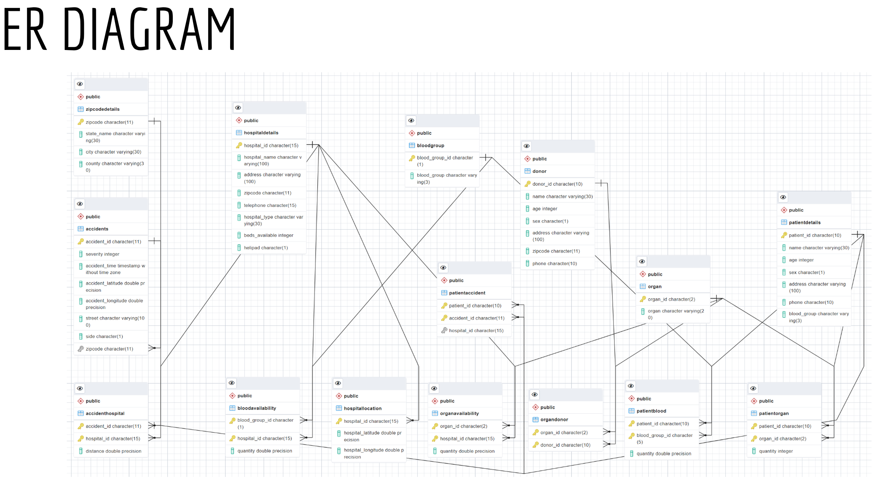
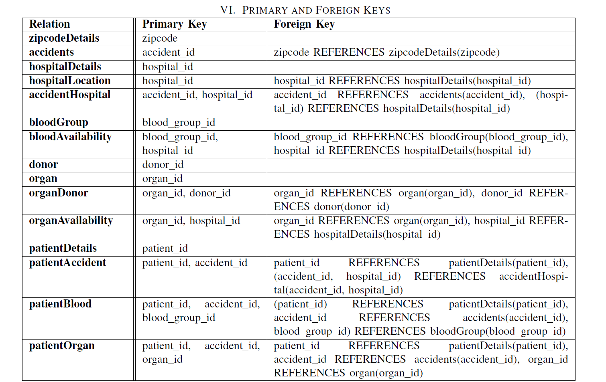
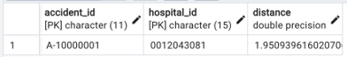
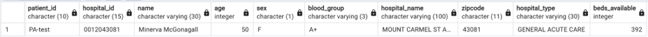
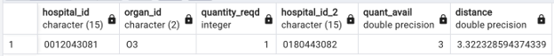
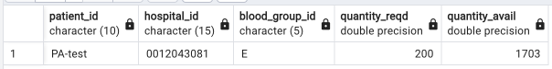

# Road Accident Analysis
========================


## Implementation
-----------------

Accident dataset downloaded from https://www.kaggle.com/datasets/sobhanmoosavi/us-accidents
Hospital dataset downloaded from https://www.kaggle.com/datasets/andrewmvd/us-hospital-locations

Steps for running the project
1. Run sql file project_ddl.sql for creating the relations
2. Run the python script initial_populate_table.py for populating data from datasets
3. Run the sql file distanceFunction.sql for creating a function
4. Populate accidenthospital relation and patient relation using populate_patient.py


##DESCRIPTION
--------------

When an accident happens, giving prompt care to the patient is of the uttmost importance. If information regarding hospital locations, resources available at that hospital is all captured in a global repository, then seamless care can be given to a patient. For instance, if blood is not available in a hospital, but we have repository where we have captured data from other hospitals as well, then blood can be procured from the nearest hospital. Using this project, we envision a product which can act as an intermediary in doing the same.


##INTRODUCTION
--------------
Injuries caused by road accidents range from minor to life-threatening. Every minute in these times can be seen as valuable in saving a life. In order to help injured people in accidents promptly, we have designed a database that helps them get admitted to the nearest hospital and get the required quantity of blood and organs if needed. We require the use of a database instead of an excel file for the following reasons:

• To handle and store a high volume of data and large files about each relation.
• To express better relationships among the attributes of data.
• New information pertaining to different relations can be added efficiently without redundant data.
• To ensure better accessibility by providing authorization and restriction among users.
• To increase the accessibility of data in terms of updating, searching, and retrieving.
• We can make use of triggers for live updates as our use-case would benefit a lot from live updates.


##TARGET USERS
--------------

**911 operators** are usually the first point of contact when an accident occurs. They would need to know where the accident took place, the intensity of the accident which injured people to send to which hospital, the location of the nearest available hospital, and details of the hospital like the number of beds available and whether they have the right resources and infrastructure to handle the treatments. Having these details would help them make the right decision to coordinate with the first responders and the hospitals with the limited time they have at hand.

The **first responders** will have access to more information when they reach the accident zone. They will be able to gauge several solutions and can make live updat  like the severity of injuries and the number of people required to visit the hospital. This update can further improve the quality of decision-making by the 911 operators and the hospital’s emergency unit. 

The **emergency unit of the hospital management** would also be required to be notified of such accidents, the number of injured people who will be incoming, and the severity of the injury so that they can plan well ahead to make the necessary accommodations.


##DATABASE IMPLEMENTATION
-------------------------

Why this database?

To ease the decision making process in finding the nearest hospital. 
Keeping the emergency unit well informed with the live updates so that they can be prepared.
Storing patient history to provide seamless care.
Centralised directory of blood and organs

Accidents data is sourced from [1] where out of the 47 columns, 10 columns which were specific to location information is used. Accidents dataset was extensively used for road accident prediction, to study the road conditions etc. In this paper, we have deviated away from the usual applications to combine it with hospital to find the nearest hospital. From the repository, 10k records were sourced for the final implementation. From the hospital dataset [2], 8 columns were extracted out of 34 columns. Both hospitals and accidents data is sourced from US. For patient and donor details, fabricated data using faker module. This data was then randonly combined with blood and organ details using a script. For blood data, 8 common blood types were used and for organ data 6 common organs were used.


##RELATIONS
-----------

<ol>
    <li>**zipcodeDetails**
        <ol>
            <li>zipcode : CHAR(11) - zipcode of the location</li>
            <li>state : VARCHAR(30) - State of the location</li>
            <li>city : VARCHAR(30) - City of the location</li>
            <li>County : VARCHAR(30) - County of the location</li>
        </ol>
    </li>

    <li>**accidents**
        <ol>
            <li>accident id : CHAR(11) - Uniquely identifies each accident</li>
            <li>severity : INTEGER - Describes the severity of the injury, varies from 1-4 (1 being lowest, and 4 being the highest)</li>
            <li>time : TIMESTAMP - Time at which the accident occurred.</li>
            <li>latitude: FLOAT - latitude of the location at which the accident occurred</li>
            <li>longitude: FLOAT - longitude of the location at which the accident occurred</li>
            <li>Street: VARCHAR(100) - Street in which the incident took place</li>
            <li>Side: CHAR(1) - Identifies which side of the road(L/R)</li>
        </ol>
    </li>

    <li>**hospitalDetails**
        <ol>
            <li>hospital id: CHAR(15) - Uniquely identifies each hospital</li>
            <li>hospital name: VARCHAR(100) - Name of the hospital</li>
            <li>Address: VARCHAR(100) - Address of the hospital</li>
            <li>Zipcode: CHAR(11) - zipcode of the hospital</li>
            <li>Telephone: CHAR(15) - contact number of the hospital</li>
            <li>Beds available: INTEGER - Number of available beds</li>
            <li>Helipad: Char(1) - Whether the hospital owns a helipad(Y/N)</li>
        </ol>
    </li>

    <li>**hospitalLocation**
        <ol>
            <li>Hospital id: CHAR(15) - Uniquely identifies each hospital</li>
            <li>Latitude: FLOAT - latitude of the location at which the hospital is located</li>
            <li>Longitude: FLOAT - latitude of the location at which the hospital is located</li>
        </ol>
    </li>

    <li>**accidentHospital**
        <ol>
            <li>Accident id: CHAR(11) - Uniquely identifies each accident</li>
            <li>Hospital id: CHAR(15) - Uniquely identifies each hospital</li>
            <li>Distance: FLOAT - Distance between the closest hospital and the accident location</li>
        </ol>
    </li>

    <li>**bloodGroup**
        <ol>
            <li>blood group id: CHAR(1) - Uniquely identifies each blood group.</li>
            <li>blood group : VARCHAR(3) - Blood group of the donor or the blood group required.</li>
        </ol>
    </li>

    <li>**bloodAvailability**
        <ol>
            <li>blood group id: CHAR(1) - Uniquely identifies each blood group.</li>
            <li>hospital id: CHAR(15) - Uniquely identifies each hospital</li>
            <li>quantity: FLOAT - Quantity of blood required</li>
        </ol>
    </li>

    <li>**donor**
        <ol>
            <li>donor id: CHAR(10) - Uniquely identifies each donor.</li>
            <li>name: VARCHAR(30) - Name of the donor</li>
            <li>age: INTEGER - Age of the donor</li>
            <li>sex: CHAR(1) - Gender of the donor (M/F)</li>
            <li>address: VARCHAR(100) - Address of the donor</li>
            <li>phone: CHAR(10) - contact number of the donor</li>
            <li>zipcode: CHAR(11) - zipcode of the donor’s house</li>
        </ol>
    </li>

    <li>**organ**
        <ol>
            <li>organ id: CHAR(2) - Uniquely identifies each organ.</li>
            <li>organ: VARCHAR(20) - Name of the organ that the donor is donating</li>
        </ol>
    </li>

    <li>**organAvailability**
        <ol>
            <li>organ id: CHAR(2) - Uniquely identifies each organ.</li>
            <li>hospital id: CHAR(15) - Uniquely identifies each hospital</li>
        </ol>
    </li>

    <li>**organDonor**
        <ol>
            <li>organ id: CHAR(2) - Uniquely identifies each organ.</li>
            <li>donor id: CHAR(10) - Uniquely identifies each donor.</li>
        </ol>
    </li>

    <li>**patientDetails**
        <ol>
            <li>patient id: CHAR(10) - Uniquely identifies each patient</li>
            <li>name: VARCHAR(30) - Name of the donor</li>
            <li>age: INTEGER - Age of the donor</li>
            <li>sex: CHAR(1) - Gender of the donor (M/F)</li>
            <li>address: VARCHAR(100) - Address of the donor</li>
            <li>phone: CHAR(10) - contact number of the donor</li>
            <li>blood group: VARCHAR(3) - blood group of the patient</li>
        </ol>
    </li>

    <li>**patientAccident**
        <ol>
            <li>patient id: CHAR(10) - Uniquely identifies each patient accident</li>
            <li>accident id: CHAR(11) - Uniquely identifies each accident</li>
            <li>hospital id: CHAR(15) - Uniquely identifies each hospital location</li>
        </ol>
    </li>

    <li>**patientBlood**
        <ol>
            <li>patient id: CHAR(10) - Uniquely identifies each patient</li>
            <li>accident id: CHAR(11) - Uniquely identifies each accident</li>
            <li>blood group id: CHAR(1) - Uniquely identifies each blood group.</li>
            <li>quantity: FLOAT - Quantity of blood required</li>
        </ol>
    </li>

    <li>**patientOrgan**
        <ol>
            <li>patient id: CHAR(10) - Uniquely identifies each patient</li>
            <li>accident id: CHAR(11) - Uniquely identifies each accident</li>
            <li>organ id: CHAR(2) - Uniquely identifies each organ.</li>
            <li>quantity: INTEGER - Quantity of organs required</li>
        </ol>
    </li>
</ol>


The following image is the snippet of the E/R Diagram




The following table represents the realationship between the Relations, Primary keys and Foreign Keys.




##SCENARIO BASED EXPLANATION

All the above information outline what the project is in detail. Now, let me explain what the project can do with different case scenarios. 

When an accident happens, the first step from an application point of view would be for the first responder to insert the
details of the accident to the application. From an application perspective, to make the process simpler, the person would just
have to click a button. Which would then capture the location information automatically and make an entry in the database. The backend sql query would be -


```sql
INSERT INTO Accidents 
VALUES ('A-10000001', 3, '2022-11-30 04:53:43', 40.10931, -82.96849, 'Outerbelt W', 'R', 43081);

```


Once the accident is entered, the next step would be to start a trigger which will find the nearest hospital. In order to find the nearest hospital dynamically a function was created to calculate the distance between two points on the Earth's surface specified by their latitude and longitude. The function uses haversine formula to calculate the shortest distance over earth's surface.

```sql
CREATE FUNCTION findDistance(lat1 float, lon1 float, lat2 float, lon2 float)
	RETURNS FLOAT 
	language plpgsql
	as
	$$
	DECLARE
		radlat1 float;
		radlat2 float;
		theta float;
		radtheta float;
		del_lat float;
		const_a float;
		const_c float;
		dist float;
	BEGIN
		radlat1 = pi() * lat1 / 180;
		radlat2 = pi() * lat2 / 180;
		del_lat = radlat1 - radlat2;
		theta = lon1 - lon2;
		radtheta = pi() * theta / 180;
		const_a = sin(del_lat/2) * sin(del_lat/2) + cos(radlat1) * cos(radlat2) * sin(radtheta/2)* sin(radtheta/2);
		const_c = 2 * atan(sqrt(const_a)/sqrt(1-const_a));
		dist = 6371* const_c;
	RETURN dist;
END;
$$
```


Once the accident is updated in the database, the next step would be to start a trigger which will find the nearest hospital using the findDistance function:


```sql

WITH AccidentWithZip AS (
    SELECT * 
    FROM accidents 
    NATURAL JOIN zipcodedetails 
    WHERE accident_id = 'A-10000001'
),

HospitalWithDetails AS (
    SELECT * 
    FROM hospitalLocation 
    NATURAL JOIN hospitaldetails 
    NATURAL JOIN zipcodedetails
),

AccidentHospitalDistance AS (
    SELECT 
        accident_id, 
        hospital_id,
        findDistance(accident_latitude, accident_longitude, hospital_latitude, hospital_longitude) AS distance
    FROM 
        AccidentWithZip AS A 
    INNER JOIN 
        HospitalWithDetails AS B
    ON 
        A.city = B.city
),

RankedDistances AS (
    SELECT 
        accident_id, 
        hospital_id, 
        distance, 
        RANK() OVER (PARTITION BY accident_id ORDER BY distance) AS distance_rank
    FROM 
        AccidentHospitalDistance
)

INSERT INTO AccidentHospital
SELECT 
    accident_id, 
    hospital_id, 
    distance 
FROM 
    RankedDistances
WHERE 
    distance_rank = 1;


```




Lets assume the patient is admitted and all her details are entered. For simplicity, those queries are not shown here. But after
insertion, if anyone wants to view the records, the following query would give the details.

```sql

SELECT 
    patient_id,
    hospital_id,
    name,
    age,
    sex,
    blood_group,
    hospital_name,
    zipcode,
    hospital_type,
    beds_available
FROM 
    patientdetails 
INNER JOIN 
    patientaccident ON patientdetails.patient_id = patientaccident.patient_id
INNER JOIN 
    hospitaldetails ON patientaccident.hospital_id = hospitaldetails.hospital_id
WHERE 
    accident_id = 'A-10000001';


```




For the next scenario, if the patient wants an organ which is not available in the hospital he/she is in, then the nearest hospital
with that organ needs to be searched for.

```sql

WITH PrimaryHospital AS (
    SELECT *
    FROM hospitallocation
    WHERE hospital_id = (
        SELECT hospital_id
        FROM patientAccident
        WHERE patient_id = 'PA-test'
    )
),

PatientOrganRequirement AS (
    SELECT organ_id, quantity AS quantity_reqd
    FROM patientorgan
    WHERE patient_id = 'PA-test'
),

SecondaryHospitalOrganAvailability AS (
    SELECT organ_id, A.hospital_id AS hospital_id_2, quantity_reqd, hosp_lat2, hosp_long2, quant_avail
    FROM (
        SELECT organ_id, hospital_id, quantity_reqd
        FROM organavailability
        NATURAL JOIN PatientOrganRequirement
    ) AS A
    NATURAL JOIN (
        SELECT organ_id, hospital_id, hospital_latitude AS hosp_lat2, hospital_longitude AS hosp_long2, quantity AS quant_avail
        FROM hospitallocation
        NATURAL JOIN organavailability
    ) AS B
),

DistanceCalculation AS (
    SELECT hospital_id, organ_id, quantity_reqd, hospital_id_2, quant_avail,
           findDistance(hospital_latitude, hospital_longitude, hosp_lat2, hosp_long2) AS distance
    FROM PrimaryHospital, SecondaryHospitalOrganAvailability
    WHERE hospital_id_2 <> hospital_id
),

RankedDistances AS (
    SELECT hospital_id, organ_id, quantity_reqd, hospital_id_2, quant_avail, distance,
           RANK() OVER (ORDER BY distance) AS distance_rank
    FROM DistanceCalculation
)

SELECT hospital_id, organ_id, quantity_reqd, hospital_id_2, quant_avail, distance
FROM RankedDistances
WHERE distance_rank = 1;


```




The organ availability is updated once the organ is procured from the nearby hospital.


```sql

UPDATE organavailability 
SET quantity = quantity - 1 
WHERE 
    organ_id = 'O3' 
    AND hospital_id = '0180443082';


```


In the next scenario, if there is need for blood, to check the availability of blood in the current hospital, the following query
is used.


```sql

WITH PatientBloodRequirement AS (
    SELECT patient_id, hospital_id, blood_group_id, quantity AS quantity_reqd
    FROM patientblood 
    NATURAL JOIN patientaccident
),

HospitalBloodAvailability AS (
    SELECT hospital_id AS hospital_id2, blood_group_id AS blood_group_id2, quantity AS quantity_avail
    FROM bloodavailability
)

SELECT 
    p.patient_id, 
    p.hospital_id, 
    p.blood_group_id, 
    p.quantity_reqd, 
    h.quantity_avail
FROM 
    PatientBloodRequirement p
INNER JOIN 
    HospitalBloodAvailability h 
ON 
    p.blood_group_id = h.blood_group_id2 
    AND p.hospital_id = h.hospital_id2
WHERE 
    p.patient_id = 'PA-test';


```




Finally, this data is updated in the database


```sql

DELETE FROM Accidents 
WHERE accident_id = 'A-10000001';


```


##FUTURE SCOPE
--------------

An application layer can be build on top of this database. Taking in account the fact that the first responder may not have time to enter all the location details manually, the location info needs to be calculated on the press of a button and the accident details should be recorded without any other input. For calculating the distance, haversine formula was used which would give the displacement between two points. In future, an actual google map route can be used to give accurate distance by road as well as looking at the traffic data for finding the nearest hospital. Also, currently only the distance is used to make the decision for choosing a hospital, it can be extended to include whether the hospital has enough beds available and factor in other variables as well.

